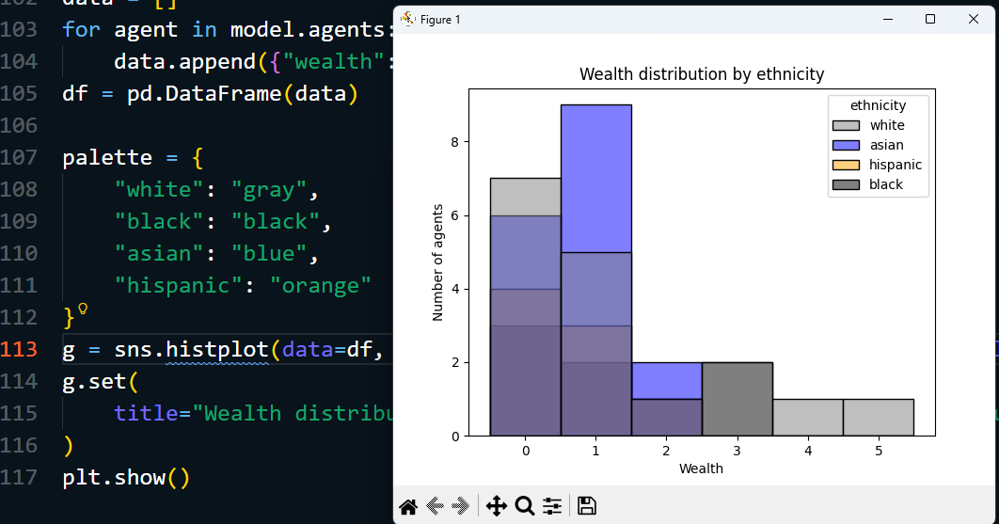

# INTRODUCTION

## super().__init__(model)
- the original mesa.Agent class (the parent) already has its own setup code. 
- It needs to assign a unique_id, set up a random number generator, and link the agent to the model.

##  what is rng
    random number generation
__rng=None (The Default)__ : Every time you run the model, get a different result.  unpredictable.

**rng= any integer**: This is called a Seed. It makes the "randomness" predictable.

# what is AgentSet
ordered collection of ag and it will auto change when add or delete each ag in collection

## chain 
doing things step by step, one after another, where each step uses the result of the previous one
You start with all agents:
    “Give me only green ones” → 🟢🟢
    “From those, give me rich ones” → 🟢💰

## Aggregation 
*model.agents.agg("wealth", [min, max, np.mean])*    

    to summarize the data such as sum avg max 
#### Aggregating subsets
*model.agents.select(lambda a: a.ethnicity == "Green").agg("wealth", np.mean)*

this is method of chain select and agg to compute statistic for spe subgroup

## confuse between dict and groupby
**dict:** select from key
    d = {"white": [1,2,3], "black": [4,5]}
    print(d["white"])   
    
**groupby:** need to be loop to execute it out
    for eth, group in model.agents.groupby("ethnicity"):
        print(eth, len(group))

## visualization 

  

